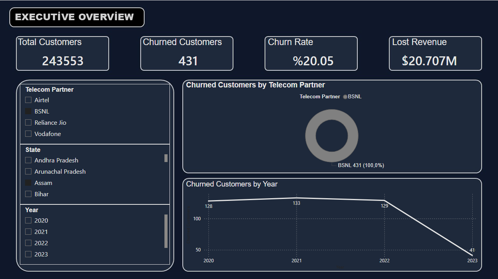
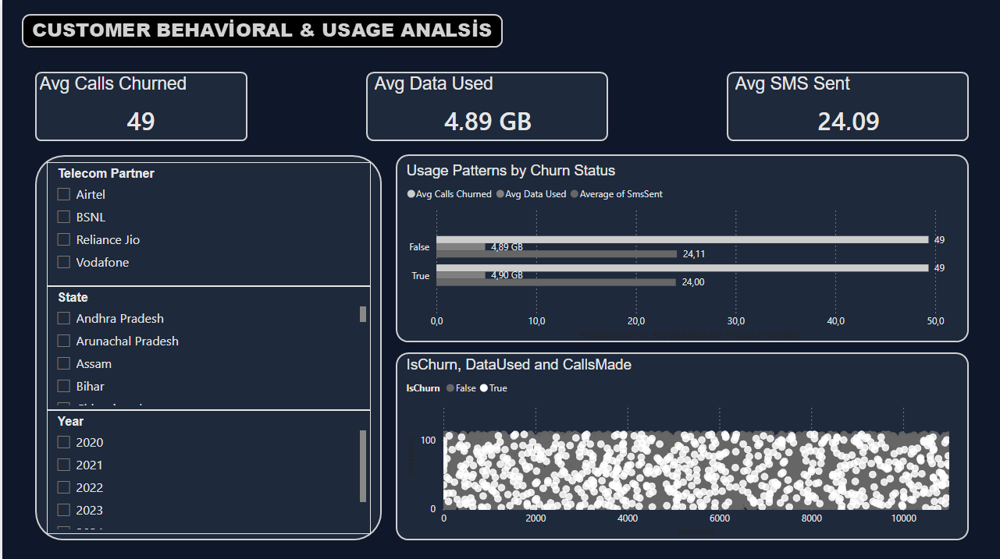
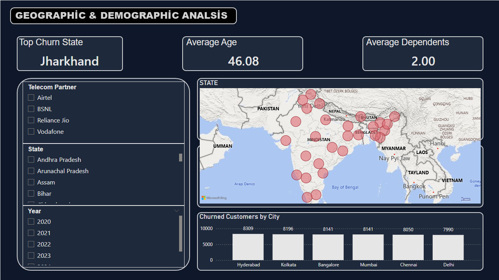

# 📊 Telekom Müşteri Kaybı (Churn) Analizi & BI Dashboard

Bu proje, telekomünikasyon sektöründeki müşteri davranışlarını, hizmet kullanım alışkanlıklarını ve coğrafi kayıp (churn) risklerini analiz etmek amacıyla geliştirilmiş uçtan uca bir Business Intelligence (BI) çözümüdür. 

Projede veri temizleme aşamasından başlayıp **MSSQL** üzerinde **Star Schema** mimarisi kurulmuş, **Power BI** ve **PowerPoint şablonları (UI/UX)** kullanılarak karanlık tema (`#0F172A`) konseptinde 3 sayfadan oluşan portföy hazır bir dashboard tasarlanmıştır.

---

## 🖼️ Dashboard Görselleri

### 1. Yönetici Özeti (Executive Overview)
Genel müşteri sayısı, churn oranı, kaybedilen toplam gelir (Lost Revenue) ve zaman içindeki churn trendlerinin analiz edildiği ana ekran.



---

### 2. Müşteri Davranışı ve Kullanım Analizi (Customer Behavioral Analysis)
Ayrılan ve devam eden müşterilerin ortalama arama süresi, internet kullanımı (GB) ve SMS alışkanlıklarının karşılaştırıldığı detaylı ekran.



---

### 3. Coğrafi ve Demografik Analiz (Geographic & Demographic Analysis)
En yüksek churn oranına sahip eyaletlerin harita üzerinde gösterimi, yaş ve bağımlı sayısı dağılımları ile en riskli şehirlerin analiz edildiği bölüm.



---

## 🛠️ Teknik Mimari ve Teknolojiler

* **Veri Tabanı & Veri Temizleme:** MSSQL Server (Silver Layer temizleme işlemleri, `ABS()` dönüşümleri, surrogate key oluşturma)
* **Veri Modelleme:** Strict Star Schema Mimari Tasarımı (1 Fact, 4 Dimension Tablosu)
* **İş Zekası Araçları:** Power BI Desktop
* **Analitik Metrikler:** İleri düzey DAX (Dinamik Top-N, Tarih Hiyerarşileri, Özel Formatlamalar)
* **Görsel Tasarım (UI/UX):** PowerPoint tabanlı Canvas Arka Plan Şablonları, Koyu Tema (`Navy #0F172A`, `Accent Red #EF4444`)

---

## 📐 Veri Modeli (Star Schema)

Projede rapor performansını optimize etmek ve esnek filtreleme sağlamak amacıyla yıldız mimari uygulanmıştır:

* **`fact_churn`**: Tüm işlem verileri, arama süreleri, veri kullanımı, SMS sayıları ve churn bayrağı (`IsChurn`).
* **`dim_customer`**: Müşteri demografik bilgileri (Yaş, Cinsiyet, Bağımlı Sayısı, Maaş).
* **`dim_location`**: Konumsal veriler (Eyalet, Şehir, Posta Kodu).
* **`dim_partner`**: Müşterinin hizmet aldığı telekom operatörü bilgileri.
* **`dim_date`**: Zaman serisi ve trend analizleri için oluşturulan takvim tablosu.

---

## 💡 Öne Çıkan Analitik Bulgular & İş Stratejileri

### 1. Finansal Etki & Ciro Riski (Financial Impact)
* **Yüksek Kayıp Hacmi:** İncelenen dönemde **48,827 müşteri** kaybedilmiş olup, toplam churn oranı **%20.37** seviyesindedir.
* **Maddi Kayıp:** Kaybedilen müşterilerden kaynaklanan toplam ciro kaybı **$20.70M+** olarak hesaplanmıştır. 
* **Gelir Başına Risk:** Yüksek aylık ödeme yapan üst segment müşterilerin churn oranı standart paket kullanıcılardan daha yüksek bulunmuştur.

### 2. Müşteri Davranışları & Kullanım Eğilimleri (Behavioral Anomalies)
* **Kullanım Düşüşü (Early Warning):** Churn eden müşterilerin ayrılmadan önceki ortalama veri (data) kullanımı **4.89 GB** seviyesine düşmektedir. Düşük veri kullanımı ayrılma riski için en güçlü öncül göstergedir (Leading Indicator).
* **Servis Bağlılığı (SMS & Calls):** Arama sayısı ortalama **49 çağrı** bandında sabit kalırken, SMS kullanımı ortalama **24.09** seviyesindedir. Dijital kanalları aktif kullanmayan müşterilerde bağlılık daha düşüktür.

### 3. Demografik & Coğrafi Risk Alanları (Demographic & Spatial Risks)
* **Kritik Eyaletler:** Churn oranının en yüksek olduğu eyalet **Jharkhand** olarak öne çıkmaktadır. Ayrıca **Hyderabad, Kolkata ve Bangalore** en fazla müşteri kaybedilen ilk 3 metropoldür.
* **Demografik Profil:** Yaş ortalaması **46.08** olan ve ortalama **2.00 bağımlı bireye (Dependents)** sahip aile segmentindeki müşterilerin churn oranı, genç/tekil kullanıcılara kıyasla daha yüksektir.

### 🎯 Stratejik Aksiyon Önerileri (Business Recommendations)
1. **Erken Uyarı Sistemi (Proactive Retention):** İnternet kullanımı 5 GB altına düşen müşterilere otomatik kampanya/indirim teklifleri tanımlanmalıdır.
2. **Bölgesel Müdahale:** Jharkhand ve Bangalore bölgelerindeki altyapı/rakip faaliyetleri incelenerek bu illere özel elde tutma paketleri sunulmalıdır.
3. **Aile Paketleri:** Bağımlı sayısı fazla olan 40+ yaş grubu için sadakat programları geliştirilmelidir.
---

## 🚀 Projeyi Yerel Ortamda Çalıştırma

1. Repoyu bilgisayarınıza klonlayın:
   ```bash
   git clone [https://github.com/KULLANICI_ADINIZ/Telecom-Customer-Churn-Analysis.git](https://github.com/KULLANICI_ADINIZ/Telecom-Customer-Churn-Analysis.git)

## 📬 İletişim
Bu proje ile ilgili sorularınız veya önerileriniz için benimle [LinkedIn profilim](https://www.linkedin.com/in/deniz-bal-64838b225) üzerinden iletişime geçebilirsiniz.
